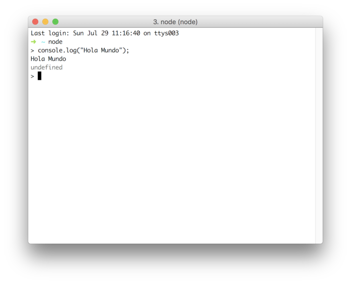
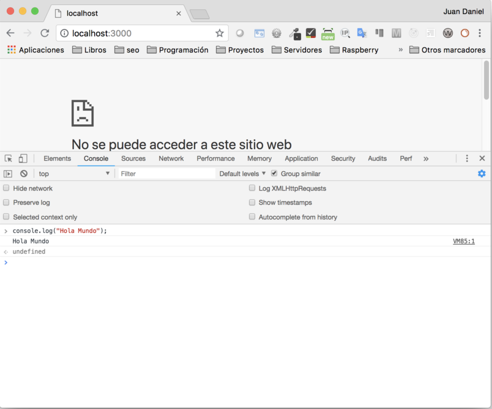

# Introducción a node.js


## Qué es node.js 
- [Sitio web de node.js](https://nodejs.org/en/):
> Node.js® is a JavaScript runtime built on Chrome's V8 JavaScript engine.

- Node.js es un intérprete de JavaScript que se ejecuta en servidor (sin navegador).

- [Situación actual del desarrollo web](https://github.com/kamranahmedse/developer-roadmap)


## Google Chrome V8

- Es el motor de JavaScript que utiliza Google Chrome y node
  - Escrito en C++
  - [Motor de código abierto](https://chromium.googlesource.com/v8/v8.git)
  - Compila a código máquina


## Hola Mundo en node




## Hola Mundo en browser




## HTML DOM


## Objeto Window en JavaScript

- Objeto global en JavaScript
- Almacena todo sobre lo que se tiene acceso


  

## Objeto "Window" en Node

- El objeto global en Node, se llama **global**:


## Objeto Document en JavaScript

- Lo que se está viendo en el navegador
- Podemos modificarlo en runtime


## Objeto Process en node

- Process (node) = document (JavaScript)
- Vemos la información del proceso node que se está ejecutando:
  - pid
  - versión de node
  - métodos
  - ...

```js
$ node
> process
....
> process.exit(3) // también podríamos hacer .exit(3), o CTRL +C dos veces
$ echo $?
3
```


## Node vs JavaScript

- El código en ambos es JavaScript
- Ambos se ejecutan con el mismo motor [si usamos Chrome)
- Node utiliza el motor fuera del contexto del navegador
  - No hay un *browser sandbox*
  - Tenemos funcionalidad añadida:
    - Acceso al file system
    - Acceso a bbdd *completa*
    - Incluso montar un servidor web


## Funcionamiento código

- Se lee el codigo en JavaScript
- Se compila a código máquina por el V8 y se ejecuta:

>V8 compiles JavaScript directly to native machine code before executing it, instead of more traditional techniques such as interpreting bytecode or compiling the whole program to machine code and executing it from a filesystem. The compiled code is additionally optimized (and re-optimized) dynamically at runtime, based on heuristics of the code's execution profile. 
[(wikipedia)](https://en.wikipedia.org/wiki/Chrome_V8)


## Características de node

- **Mismo lenguaje en cliente y servidor**
  - Permite a cualquier persona desarrollar en backend o en frontend
  - Permite reusar código o incluso mover código de cliente a servidor o al revés

- **No bloqueante (asíncrono) por naturaleza**
  - Los métodos síncronos, llevan el sufijo sync

- El **mayor repositorio de código disponible**: [npm](https://www.npmjs.com/)
  - composer(php) o jpm(java) están basados en npm

- **Orientado a eventos**


- Es monohilo
  - Utiliza un solo procesador
  - Si queremos usar toda la potencia de la CPU, tendremos que levantar varias instancias de node y utilizar un balanceador de carga ([por ejemplo con pm2](https://github.com/Unitech/pm2))


- Llamadas síncronas en servidor serían fatales:
  - ¡Bloqueariamos las conexiones al servidor hasta que acabase la instrucción bloqueante!
  - Al ser asíncrono podremos tener muchas sesiones concurrentes


## Ejemplo código no bloqueante

```js
const fs = require('fs')
fs.readFile('./prueba.txt', 'utf-8', (err, data) => {
  if (err) throw err
  console.log(`El contenido del fichero es este: ${data}`)
})
console.log(`Aquí todavia no tenemos el valor de fs.readFile`)
```


## Ejemplo código bloqueante

```js
const fs = require('fs');
const data = fs.readFileSync('./prueba.txt', 'utf-8');
console.log(`El contenido del fichero es este: ${data}`)
```


## Consulta de API de node

- El módulo fs pertenence a los core modules de node, no es necesario instalarlo
- Para consultar la API:
  - [Desde el navegador](https://nodejs.org/api/index.html)
  - Desde el terminal (plugin node de zsh)
    ```bash
      $ node-docs
     ```


## Bloqueante vs no bloqueante

- El **código asíncrono** tiene un **throughput mucho mayor**.
- Se puede volver **complejo** el trabajar con el resultado de una función asíncrona.
  - El código asíncrono no se ejecuta de forma secuencial, más dificil de seguir
  - El método asíncrono recibe como último parámetro una **función de callback**


## ¿Qué sería lo ideal?
- Utilizar **código secuencial y asíncrono**
  - Para ello utilizaremos **promesas** y **async/await**


# Versiones de JS


## ECMAScript

- Estándarización del JavaScript de NetScape (1997)
- Implementaciones de ECMAScript:
  - JavaScript
  - JScript (Microsoft)
  - ActionScript (Adobe)
  - ..


## [TC39](https://github.com/tc39/)

- [Cómite técnico encargado de la especificación de ECMAScript](https://github.com/orgs/tc39/people)
  - Yahoo
  - Paypal
  - Google
  - Microsoft
  - ....


## JavaScript timeline


## ECMAScript 4
- A favor de grandes cambios:
  - Microsoft (Silverlight con C#)
  - Adobe (Adobe air con ActionScript)
- A favor de mantener compatibilidad con lo anterior:
  - Google
  - Yahoo


## ECMAScript 5
- No tiene tantas grandes novedades
- jQuery nace en el 2006 para paliar las diferencias entre navegadores


## ECMAScript 6
- Grandes novedades
- Se pueden usar [transpilers](https://babeljs.io/)


## Versiones actuales
- ES6: Jun 2015
  - El comite decidió publicar especificaciones ECMAScript de forma anual
  - Se renombro a **ES2015** 

- **ES2016** (ES7)

- **ES2017** (ES8)

- **ES.Next**: Término dinámico, se refiere a la próxima versión de ECMAScript.


## ¿Qué puedo usar?

- En Web tenemos que vivir con la fragmentación 
  - V8 - Google Chrome (Chromium, MongoDB)
  - SpiderMonkey Firefox (GNOME, Adobe).
  - Chakra -  Microsoft IE y Edge
- En Node es más sencillo porque:
  - Solo hay un motor
  - Nosotros elegimos su versión


- Node: 
  - http://kangax.github.io/compat-table/es5/
  - https://node.green/

- Web:
  - https://caniuse.com


# ¿Empezamos el código?

- [Primer proyecto](./1-proyecto-hola-usuario.md)